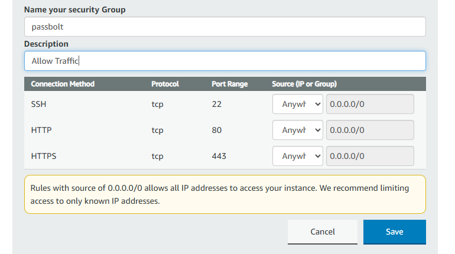
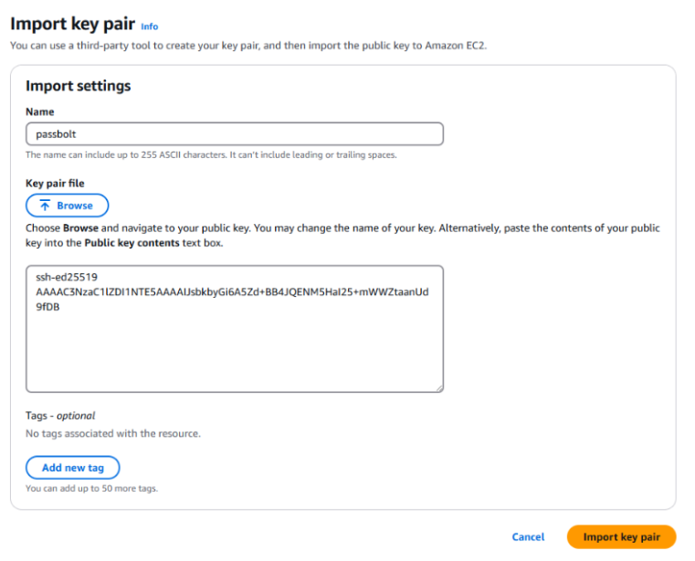
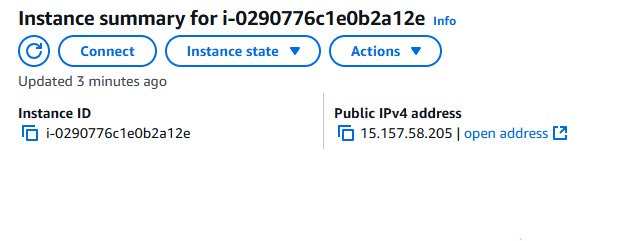
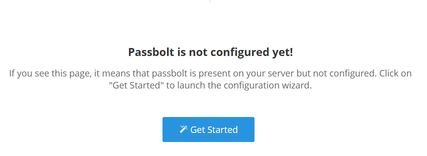
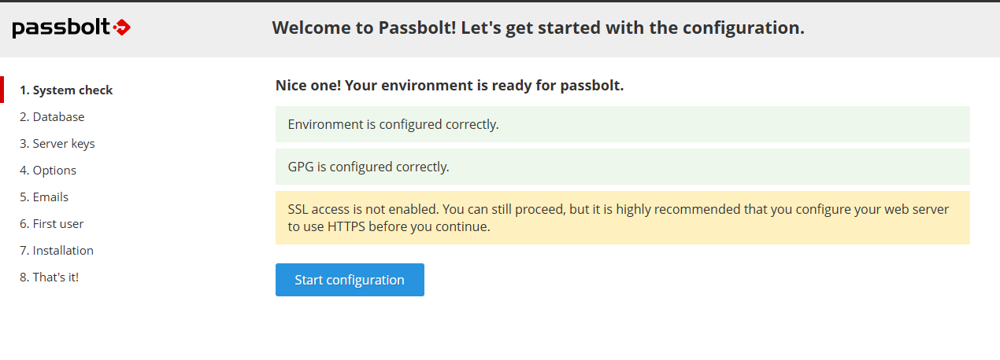
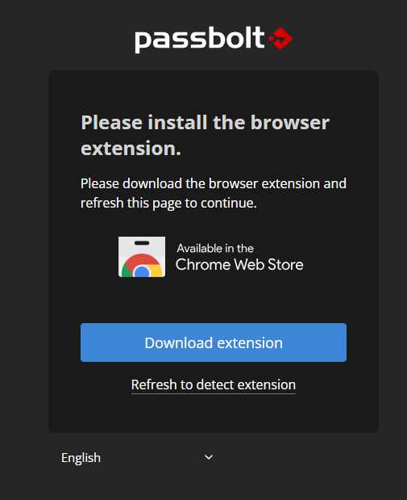
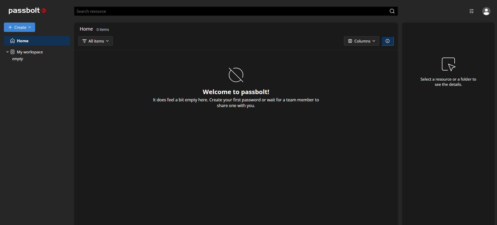
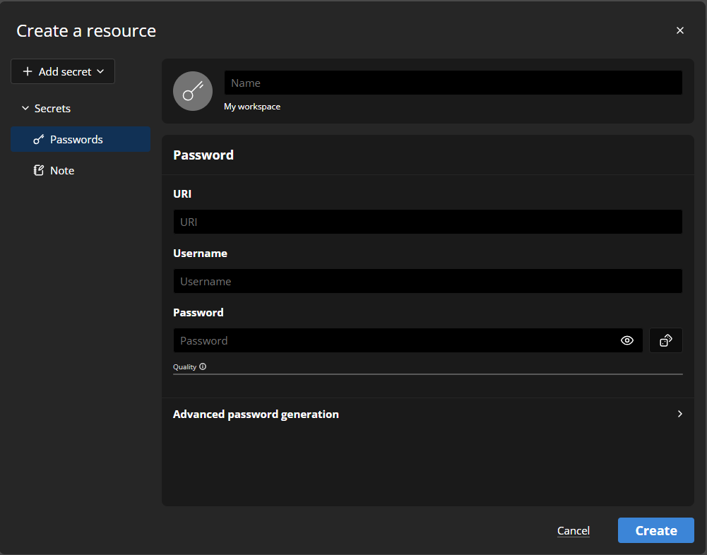

# 🔐 Self-Hosted Password Manager Deployment using Passbolt on AWS

## Table of Contents

- [Project Overview](#project-overview)
- [Prerequisites](#prerequisites)
- [Step 1: Set Up Ubuntu on VirtualBox](#️step-1-set-up-ubuntu-on-virtualbox)
- [Step 2: Generate SSH Key Pair](#step-2-generate-ssh-key-pair)
- [Step 3: Deploying Passbolt Instance on AWS](#step-3-deploying-passbolt-instance-on-aws)
- [Step 4: Launching Passbolt on AWS](#step-4-launching-passbolt-on-aws)
- [Step 5: Access Passbolt via Public IP](#step-5-access-passbolt-via-public-ip)
- [Step 7: Complete Passbolt Setup](#️-step-7-complete-passbolt-setup)
- [Skills Demonstrated](#skills-demonstrated)
- [Conclusion](#conclusion)

---

## Project Overview

This project showcases how to deploy a **secure, self-hosted password manager** using [Passbolt](https://www.passbolt.com/) on an AWS EC2 instance with **HTTPS encryption**, SSH key-based authentication, and public access configuration. It strongly adds to your cybersecurity portfolio, demonstrating secure cloud deployment, encryption, and access control.

---

## Prerequisites

- AWS account → [Sign up here](https://aws.amazon.com/account/)
- VirtualBox → [Download VirtualBox](https://www.virtualbox.org/)
- Ubuntu ISO → [Download Ubuntu](https://ubuntu.com/download/desktop)
- Registered [Passbolt account](https://www.passbolt.com/)
- Basic knowledge of terminal and SSH

---

## Step 1: Set Up Ubuntu on VirtualBox

1. Download the Ubuntu ISO and create a new Virtual Machine in VirtualBox.
2. Allocate at least 2GB RAM and 20GB storage.
3. Boot into Ubuntu and complete installation.

---

## Step 2: Generate SSH Key Pair

On your Ubuntu VM, open a terminal and generate SSH keys:

```bash
ssh-keygen
cat ~/.ssh/id_rsa.pub
```

---

## Step 3: Deploying Passbolt Instance on AWS

1. Go to passbolt.com > Install on-prem > select the Community edition.
2. Choose AWS as your deployment platform.
3. After selecting the AWS region and confirming pricing, a Passbolt AMI instance will be deployed automatically in your AWS account.
---

## Step 4: Launching Passbolt on AWS

### During instance setup or afterwards:

1. Navigate to **EC2 > Security Groups**.
2. Create a new security group or edit the one attached to your instance.
3. Add the following **Inbound Rules**:

| Type     | Protocol | Port Range | Source          |
|----------|----------|------------|-----------------|
| SSH      | TCP      | 22         | Anywhere (0.0.0.0/0) |
| HTTP     | TCP      | 80         | Anywhere (0.0.0.0/0) |
| HTTPS    | TCP      | 443        | Anywhere (0.0.0.0/0) |

> These rules allow remote access via SSH and ensure web access for Passbolt.

**Screenshot:**  



### If you generated your own SSH key on Ubuntu:

1. In Ubuntu terminal, run:
   ```bash
   cat ~/.ssh/id_rsa.pub
    ```
   
2. Copy all the contents of the public key.

3. Go to EC2 > Key Pairs on the AWS console.

4. Click Actions > Import Key Pair.

5. Paste the copied key and give it a name (e.g., ubuntu-key), then click Import.

Screenshot:



After importing the key pair, refresh the key pair option and click LAUNCH.
When you click on the launch button, you will receive a notification.


### Congratulations! An instance of this software is successfully deployed on EC2!

---

## Step 5: Access Passbolt via Public IP

1. Once your EC2 instance is running, navigate to the **EC2 Console**.
2. Find your instance and locate its **Public IPv4 address**.
3. Open a web browser and go to:

http://'your-public-ip'


4. You should see the **Passbolt setup wizard**.

> If you do not see the page, ensure your security group allows inbound traffic on ports 80 and 443.

**Screenshot:**  
`

-----

## 🛠️ Step 7: Complete Passbolt Setup

1. Click **Start Configuration** on the welcome page.
2. Enter the **Server Name**, database credentials (usually pre-filled), and an admin email address.
3. Follow the on-screen steps. After setup, you'll be prompted to:
   - Download the **Passbolt browser extension**.
   - Create a **password** and **security token**.

4. After registration, you will be redirected to the **Passbolt dashboard**.

5. You can now start creating, storing, and sharing complex passwords securely.

**Screenshot:**  




**Screenshot:**  



---

## Skills Demonstrated

- ✅ Deployment of secure infrastructure using **AWS EC2**
- ✅ Implementation of **self-hosted password management** with **Passbolt**
- ✅ Use of **SSH key pairs** and secure connection protocols
- ✅ Configuration of **firewall rules and security groups**
- ✅ Setting up **HTTPS encryption** for secure data transmission
- ✅ Hands-on experience with **Ubuntu Linux** and cloud-native tools

----

## Conclusion

This project demonstrates the ability to design and implement a secure, self-hosted password management solution using **Passbolt** on **AWS Cloud**.

By completing this deployment:

- You gain hands-on experience in **cloud infrastructure**, **security best practices**, and **HTTPS configuration**.
- You validate your ability to manage **sensitive information securely** in a cloud environment.
- This serves as a practical, resume-ready project to showcase cloud and cybersecurity skills.

---

